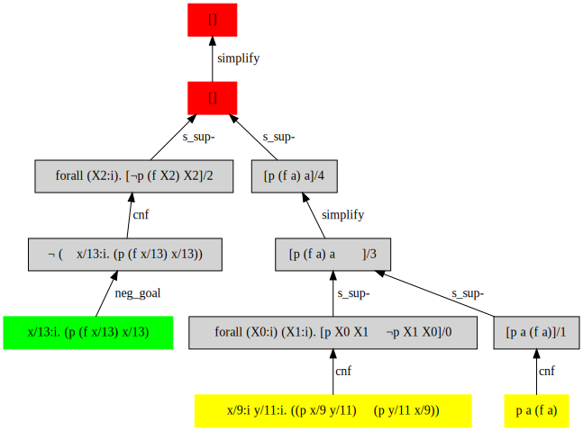

= Zipperposition
:toc: macro
:source-highlighter: pygments

- Automated theorem prover for first-order logic with equality and theories.
- Logic toolkit (`logtk`), designed primarily
  for first-order automated reasoning. It aims
  at providing basic types and algorithms (terms, unification, orderings,
  indexing, etc.) that can be factored out of several applications.

toc::[]

== Short summary

Zipperposition is intended to be a superposition prover for full first
order logic, plus some extensions (datatypes, recursive functions, arithmetic).
The accent is on flexibility, modularity and simplicity rather than
performance, to allow quick experimenting on automated theorem proving. It
generates TSTP traces or graphviz files for nice graphical display.

Zipperposition supports several input formats:

- TPTP (fof, cnf, tff)
- https://tip-org.github.io/[TIP]
- its own native input, extension `.zf` (see directory `examples/`)

Zipperposition is written in the functional and imperative language
https://ocaml.org[OCaml]. The name is a bad play on the words "zipper" (a
functional data structure) and "superposition" (the calculus used by the
prover), although the current implementation is written in quite an imperative style.
Superposition-based theorem proving is an active field of research, so
there is a lot of literature about it; for this implementation my main references
are:

* the chapter _paramodulation-based theorem proving_ of the _handbook of automated reasoning_,
* the paper _E: a brainiac theorem prover_ that describes the http://eprover.org[E prover] by S.Schulz,
* the paper _Superposition with equivalence reasoning and delayed clause normal form transformation_ by H.Ganzinger and J.Stuber

**Disclaimer**: Note that the prover is currently a prototype and is
likely not complete. Please don't use it to drive your personal
nuclear power plant, nor as a trusted tool for critical applications.

== License

This project is licensed under the BSD2 license. See the `LICENSE` file.

== Build

Zipperposition requires OCaml >= 4.03.0, and some libraries that are
available on opam.

[[via-opam]]
=== Via opam

The recommended way to install Zipperposition is through http://opam.ocaml.org/[opam].
You need to have GMP (with headers) installed (it's not handled by opam).
Once you have installed GMP and opam, type:

----
$ opam install zipperposition
----

To upgrade to more recent versions:

----
$ opam update

$ opam upgrade
----

If you want to try the development (unstable) version, which has more
dependencies (in particular Oasis for the build), try:

    $ opam pin add zipperposition -k git https://github.com/c-cube/zipperposition.git#dev

NOTE: do *not* install `logtk`. It now ships with zipperposition itself.
NOTE: if installation fails, you might want to try to `opam update` and
  `opam upgrade`: it might be because some of the dependencies are too old.

=== Manually

If you really need to, you can download a release on the
following https://github.com/c-cube/zipperposition/releases[github page for releases].

Look in the file `opam` to see which dependencies you need to install.
They include `menhir`, `zarith`, `containers`,
`oclock`, https://github.com/Gbury/mSAT[msat] and `sequence`, but
maybe also other libraries. Consider using opam directly if possible.

----
$ ./configure

$ make install
----

Additional sub-libraries can be built if their respective dependencies
are met, and the appropriate `./configure --enable-foobar` flag was set.

If http://cristal.inria.fr/~fpottier/menhir/[menhir] is installed, the
parsers library `Logtk_parsers` can be built with

----
$ ./configure --enable-parsers
----

If you have installed https://github.com/c-cube/qcheck/[qcheck], for instance
via `opam install qcheck`, you can enable the property-based testing and
random term generators with

----
$ ./configure --enable-qcheck --enable-tests
$ make tests
----

NOTE: in case of build errors, it might be because of outdated dependencies
(see <<via-opam>> for more details), or stale build files.
Try `rm _build setup.data -rf` to try to build from scratch.

== Use

Typical usage:

----
$ zipperposition --help
$ zipperposition problem_file [options]
$ zipperposition --arith examples/ARI114=1.p
$ zipperposition --dot /tmp/foo.dot examples/ind/nat1.zf
----

to run the prover. Help is available with the option `--help`.
For instance,

----
$ zipperposition examples/pelletier_problems/pb47.p --ord rpo6 --timeout 30
----

Several tools are shipped with Zipperposition, including a CNF converter, a type-checker,
etc. They are built if the flag `--enable-tools` is set. Documentation
will be built provided `--enable-docs` is set.

After the configuration is done, to build the library, documentation and tools
(given the appropriate flags are set), type in a terminal located in the root
directory of the project:

----
$ make
----

If you use `ocamlfind` (which is strongly recommended),
installation/uninstallation are just:

----
$ make install
$ make uninstall
----

=== Native Syntax

The native syntax, with file extension `.zf`, resembles a simple fragment of
ML with explicit polymorphism. Many examples
in `examples/` are written using this syntax.
A vim https://github.com/c-cube/vim-zf[syntax coloring file] is available.

==== Basics

Comments start with `#` and continue to the end of the line.
Every symbol must be declared, using the builtin type `prop` for propositions.
A type is declared like this: `val i : type.`
and a parametrized type: `val array: type -> type.`

----
val i : type.
val a : i.

val f : i -> i. # a function
val p : i -> i -> prop. # a binary predicate
----

Then, axioms and the goal:

----
assert forall x y. p x y => p y x.
assert p a (f a).

goal exists (x:i). p (f x) x.
----

We can run the prover link:doc/example.zf[on a file containing these declarations].
It will display a proof very quickly:

----
$ ./zipperposition.native example.zf

% done 3 iterations
% SZS status Theorem for 'example.zf'
% SZS output start Refutation
* ⊥/7 by simp simplify with [⊥]/5
* [⊥]/5 by
  inf s_sup- with {X2[1] → a[0]}
    with [p (f a) a]/4, forall (X2:i). [¬p (f X2) X2]/2

* forall (X2:i). [¬p (f X2) X2]/2 by
  esa cnf with ¬ (∃ x/13:i. (p (f x/13) x/13))

* [p (f a) a]/4 by simp simplify with [p (f a) a ∨ ⊥]/3
* [p (f a) a ∨ ⊥]/3 by
  inf s_sup- with {X0[0] → f a[1], X1[0] → a[1]}
    with [p a (f a)]/1, forall (X0:i) (X1:i). [p X0 X1 ∨ ¬p X1 X0]/0

* ¬ (∃ x/13:i. (p (f x/13) x/13)) by
  esa neg_goal negate goal to find a refutation
    with ∃ x/13:i. (p (f x/13) x/13)

* ∃ x/13:i. (p (f x/13) x/13) by goal 'example.zf'
* forall (X0:i) (X1:i). [p X0 X1 ∨ ¬p X1 X0]/0 by
  esa cnf with ∀ x/9:i y/11:i. ((p x/9 y/11) ⇒ (p y/11 x/9))

* [p a (f a)]/1 by esa cnf with p a (f a)
* p a (f a) by 'example.zf'
* ∀ x/9:i y/11:i. ((p x/9 y/11) ⇒ (p y/11 x/9)) by 'example.zf'

% SZS output end Refutation
----

Each `*` -prefixed item in the list is an inference step. The top step is
the empty clause: zipperposition works by negating the goal before looking
for proving `false`. Indeed, proving `a ⇒ b` is equivalent to deducing
`false` from `a ∧ ¬b`.

==== Connectives and Quantifiers

The connectives are:

true:: `true`
false:: `false`
conjunction:: `a && b`
disjunction:: `a || b`
negation:: `~ a`
equality:: `a = b`
disequality:: `a != b` (synonym for `~ (a = b)`)
implication:: `a => b`
equivalence:: `a <=> b`

Implication and equivalence have the same priority as disjunction.
Conjunction binds tighter, meaning that `a && b || c`
is actually parsed as `(a && b) || c`.
Negation is even stronger: `~ a && b` means `(~ a) && b`.

Binders extend as far as possible to their right, and are typed, although
the type constraint can be omitted if it can be inferred:

universal quantification:: `forall x. F`
  or in its typed form: `forall (x:ty). F`
existential quantification:: `exists x. F`

Polymorphic symbols can be declare using `pi <var>. type`,
for instance `val f : pi a b. a -> array a b -> b` is a polymorphic
function that takes 2 type arguments, then 2 term arguments.
An application of `f` will look like `f nat (list bool) (Succ Z) empty`.
Type arguments might be omitted if they can be inferred.

==== Inclusion

It can be convenient to put commonly used axioms in a separate file.
The statement

----
include "foo.zf".
----

will include the corresponding file (whose path is relative to the
current file).

==== Advanced Syntax

There are more advanced concepts that are mostly related to induction:

datatypes:: (here, Peano numbers and polymorphic lists)
+
----
data nat := Zero | Succ nat.

data list a := nil | cons a (list a).
----

simple definitions::
+
----
def four : nat := Succ (Succ (Succ (Succ Zero))).
----

rewrite rules::
+
A rewrite rule is similar to an `assert` statement, except it is much
more efficient. Zipperposition assumes that the set of rewrite rules
in its input is *confluent* and *terminating* (otherwise, no guarantee
applies). Rewriting can be done on terms and on atomic formulas:
+
----
val set : type -> type.

val member : pi a. a -> set a -> prop.

val union : pi a. set a -> set a -> set a.

rewrite forall a (x:a)(s1:set a)(s2:set a).
  member x (union s1 s2) <=> (member x s1 || member x s2).

val subset : pi a. set a -> set a -> prop.

rewrite forall a (s1:set a)(s2:set a).
  subset s1 s2 <=> (forall x. member x s1 => member x s2).

val equal_set : pi a. set a -> set a -> prop.

rewrite forall a (s1:set a) s2.
  equal_set s1 s2 <=> subset s1 s2 && subset s2 s1.

# now show that union is associative:
goal forall a (s1:set a) s2 s3.
  equal_set
   (union s1 (union s2 s3))
   (union (union s1 s2) s3).
----
+
there are several variations on literal rewrite rules:
+
- `rewrite forall x. p x` (short for `p x <=> true`)
- `rewrite forall x. ~ p x` (short for `p x <=> false`)
- `rewrite forall x. p x => q x`
  (one way rule, will rewrite `p x` but not `~ p x`; also called _polarized rewriting_)
- `rewrite forall x. ~ p x => q x`
  (negative polarized rule)

recursive definitions::
+
one can write recursive functions (assuming they terminate), they
will be desugared to a declaration + a set of rewrite rules:
+
----
def plus : nat -> nat -> nat where
  forall y. plus Zero y = y;
  forall x y. plus (Succ x) y = Succ (plus x y).
----
+
Mutually recursive definitions are separated by `and`:
+
----
def even : nat -> prop where
  even Zero;
  forall x. even (Succ x) = odd x
and odd : nat -> prop where
  forall x. odd (Succ x) = even x.
----
+
Zipperposition is able to do simple inductive proofs using these recursive
functions and datatypes:
+
----
$ cat doc/plus_assoc.zf
data nat := Zero | Succ nat.
def plus : nat -> nat -> nat where
  forall y. plus Zero y = y;
  forall x y. plus (Succ x) y = Succ (plus x y).
goal forall (x:nat) y z. plus x (plus y z) = plus (plus x y) z.

$ zipperposition doc/plus_assoc.zf -o none
% done 17 iterations
% SZS status Theorem for 'doc/plus_assoc.zf'
----

conditionals::
+
tests on boolean formulas are written `if a then b else c`, where `a:prop`,
`b`, and `c`, are terms. `b` and `c` must have the same type.

pattern-matching::
+
shallow pattern matching is written `match <term> with [case]+ end`
where each case is `| <constructor> [var]* -> <term>`.

AC symbols::
+
Some symbols can be declared "associative commutative": they satisfy
+
- `forall x y z. f x (f y z) = f (f x y) z`
- `forall x y. f x y = f y x`.
+
the following statement is a bit more efficient than writing the corresponding
axioms:
+
----
val[AC] f : foo -> foo -> foo.
----

Axioms in _Set of Support_::
+
Some axioms (introduced using `assert [sos] <formula>.`) will be considered
as part of the so-called "set of support" strategy.
No saturation among SOS axioms is done. They are only used for inferences
(and simplifications) with non-SOS axioms and goals.
Typically this is useful for introducing general lemmas while preventing them
from interacting in ways not related to the current goal.

Named Axioms::
+
An axiom can be given a name, as in TPTP, to retrieve it easily in proofs.
The syntax is:
+
----
assert[name "foo"] bar.
----

[[graphical-proof]]
=== Graphical Display of Proofs

A handy way of displaying the proof is to use http://graphviz.org/[graphviz]:

----
$ ./zipperposition.native --dot /tmp/example.dot example.zf
$ dot -Txlib /tmp/example.dot
----

One can generate an image from the `.dot` file:

----
$ dot -Tsvg /tmp/example.dot > some_picture.svg
----

=== Proof Format

It is possible to avoid displaying the proof at all, by using `-o none`.
A TSTP derivation can be obtained with `-o tstp`.

=== Library

Zipperposition's library provides several useful
parts for logic-related implementations:

- a library packed in a module `Logtk`, with terms, formulas, etc.;
- a library packed in a module `Logtk_parsers`, with parsers for input formats;
- small tools (see directory `src/tools/`) to illustrate how to use the library
    and provide basic services (type-checking, reduction to CNF, etc.);

== Hacking

Some advices if you want to hack on the code:

- `--debug 5` prints everything the prover does
- `--debug.foo <n>` changes the verbosity only for `foo` (see `--help`
  for a list of such flags)
- `--backtrace` is very useful to get stack traces when a
  wild uncaught exception appears
- `--stats` prints some statistics, and you can add your own easily
  with `Util.mk_stat`
- `--dot <some-file>.dot` dumps the proof in the given file
  in graphviz. This is very useful for reading proofs, e.g.
  using `dot -Txlib <some-file>.dot`.
  See <<graphical-proof, graphical display of proofs>> for more details.
- many flags control the behavior of the prover; to dumb heuristics down
  a bit you can try:
  * `-cq bfs` (BFS traversal of the search space, instead of weight-based
    clause selection rules)
  * `--ord none` for disabling term orderings

== StarExec

StarExec is a service for experimental evaluation of logic solvers like Zipperposition. 

The easiest way to import Zipperposition as a solver is to pre-compile Zipperposition on the https://www.starexec.org/vmimage/[StarExec virtual machine]. Download the VM image and open it in VirtualBox. 

Open the settings of the VM. Set "Network > Adapter 1 > Attached to" to NAT to have internet access from inside the VM. To allow SSH access into the VM open "Network > Adapter 1 > Advanced > Port Forwarding" and create a new rule:

----
Name: ssh
Protocol: TCP
Host Port: 3022
Guest Port: 22
----

Leave the two IP fields empty.

Start the VM. Log in as root using the password "St@rexec".

----
starclone login: root
Password: St@rexec
----

Install the openssh server to get a more convenient access to the machine and to copy the compiled binary later.

----
$ yum install openssh-server
----

Now open a terminal on the host machine while the VM is still running. Tunnel into the VM via SSH:

----
$ ssh -p 3022 root@127.0.0.1
root@127.0.0.1's password: St@rexec
----

Install OPAM:

----
$ wget https://raw.github.com/ocaml/opam/master/shell/opam_installer.sh -O - | sh -s /usr/local/bin
----

So far we have used the superuser root. To download and compile Zipperposition we will use a regular user that we create as follows:

----
$ useradd -m bob
$ passwd bob
New password: bob
BAD PASSWORD: The password is a palindrome
Retype new password: bob
passwd: all authentication tokens updated successfully.
----

Close the SSH connection and reopen it as the new user:

----
$ exit
$ ssh -p 3022 bob@127.0.0.1
bob@127.0.0.1's password: bob
----

Initialize OPAM. Install OCaml 4.05 and the dependencies of Zipperposition (Look in the file `opam` to see which dependencies you need to install).

----
$ opam init
$ opam switch 4.05.0+flambda
$ eval `opam config env`
$ opam install zarith containers sequence oasis msat menhir
----

Clone Zipperposition and compile it:

----
$ git clone https://github.com/c-cube/zipperposition.git --branch dev
$ cd zipperposition
$ make
----

Close the SSH connection and copy the binary from the VM onto your host machine.

----
$ exit
$ scp -P 3022 bob@127.0.0.1:~/zipperposition/zipperposition.native  /some/path/on/the/host/machine
bob@127.0.0.1's password: bob
----

As described https://www.starexec.org/starexec/secure/help.jsp?ref=/starexec/secure/add/solver.help[in the StarExec documentation] you need a script whose filename has the prefix `starexec_run_` to execute your solver. For Zipperposition this script could look like this:

----
#!/bin/sh

./zipperposition.native -o tptp "$1" \
  --timeout "$STAREXEC_WALLCLOCK_LIMIT" \
  --mem-limit "$STAREXEC_MAX_MEM"
----

Put this script and the file `zipperposition.native` into a folder called `bin`. Create a ZIP archive containing that folder. Now Zipperposition is ready to be uploaded to StarExec!

== Documentation

See http://c-cube.github.io/zipperposition/[this page].

There are some examples of how to use the code in `src/tools/`
and `src/demo/`.

== Docker

(experimental)

to build an image:

- `docker build -t zipper .`

to use the image:

- `docker run -i zipper < examples/pelletier_problems/pb47.zf`

== Howto (for devs)

=== Make a release

Now we use jbuilder, it should simplify the process compared to oasis.

- merge `dev` into `master`:
  `git checkout master; git merge dev`

- `make clean all` (to rerun tests, etc. see if merge was ok)

- merge `master` into `stable` (branch with only releases):
  `git checkout stable; git merge master --no-ff`

- edit `*.opam` files to update the version number (field `version`).

- `git commit -a -m "prepare for <version>"` (to save the changes on the stable branch)

- `make clean all` (to check everything builds properly)

- `git tag <version>` (e.g. `git tag 1.4`)

- `git push origin <version>` (`origin` being the name of the github remote)

- `opam publish prepare zipperposition.1.4 https://github.com/c-cube/zipperposition/archive/1.4.tar.gz`
  (using the actual version number).
  This might require to `opam install opam-publish` first, it's a handy opam plugin
  for managing releases.

- if that works properly, then it will create a directory `zipperposition.<version>`.
  Just run `opam publish submit zipperposition.1.4` to open a PR against
  opam-repository.

If something is wrong with the release, it's possible to change it.
This is a bit brutal, *never* do it for older releases that have been
merged into opam-repo, only for the next release while no one has seen it yet.

- `git tag -f <version>; git push origin :<version> ; git push origin <version>`
  to change the tag

- re-run the two `opam publish` commands to update the directory and
  the PR.

